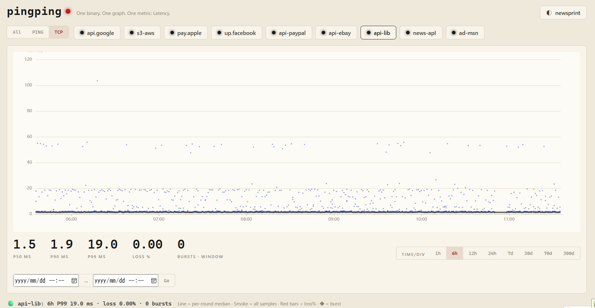
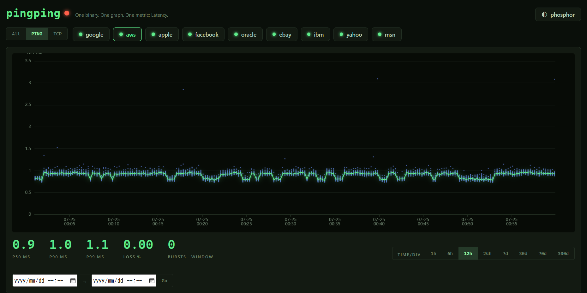
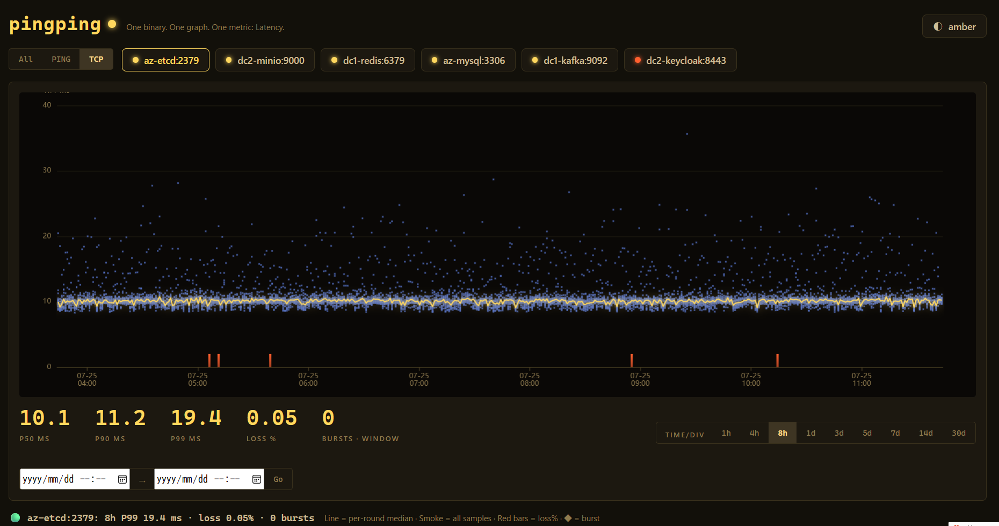

A smokeping-like network tool
-----One binary file-----
Just scp and run
one static Go binary with an embedded SQLite database, a built-in web UI and login.
No Perl, no RRDtool, no cron, no web server, no config file.





## Quick start

```bash
mkdir -p ~/fogping && cd ~/fogping
wget https://github.com/githubflyideas/fogping/releases/download/v1.1.2/fogping-v1.1.2-linux-amd64.tar.gz
tar -xzf fogping-v1.1.2-linux-amd64.tar.gz
./fogping --edit user=admin passwd=change-me
```

Open `http://<server>:8518`, log in, click **✎ targets** and add the hosts you
want to watch. A demo target (www.google.com) is already there so the very first
start shows smoke. Once your targets are in, restart without `--edit`: the UI
becomes read-only again.

`./fogping --help` prints the common commands with copy-ready examples. The rest of
this page covers each step in detail.


## Contents

- [Requirements](#requirements)
- [Install](#install)
- [Allow ICMP (ping) without root](#allow-icmp-ping-without-root)
- [First start](#first-start)
- [Common commands](#common-commands)
- [Managing targets](#managing-targets)
- [Run as a systemd service](#run-as-a-systemd-service)
- [Behind a reverse proxy](#behind-a-reverse-proxy)
- [Data, retention and backup](#data-retention-and-backup)
- [Reading the chart](#reading-the-chart)
- [Upgrading](#upgrading)
- [Troubleshooting](#troubleshooting)
- [Build from source](#build-from-source)

## Requirements

- Linux on x86-64. The release binary is statically linked, so the distribution
  and its glibc version do not matter.
- For PING targets: permission to send ICMP (see [below](#allow-icmp-ping-without-root)).
  TCP targets need no special permission.
- TCP port 8518 reachable from your browser — or `--localhost` plus a reverse proxy.
  The port is fixed at 8518.
- Nothing else: no database server, no runtime, no web server.

## Install

```bash
sudo mkdir -p /opt/fogping && sudo chown "$USER": /opt/fogping && cd /opt/fogping
wget https://github.com/githubflyideas/fogping/releases/download/v1.1.2/fogping-v1.1.2-linux-amd64.tar.gz
wget https://github.com/githubflyideas/fogping/releases/download/v1.1.2/SHA256SUMS
sha256sum --ignore-missing -c SHA256SUMS     # expect: fogping-v1.1.2-linux-amd64.tar.gz: OK
tar -xzf fogping-v1.1.2-linux-amd64.tar.gz
./fogping --version
```

The tarball contains only `fogping` and `LICENSE`. Everything fogping writes goes
into one directory it creates where you start it: `data/` — so the start
directory must be writable by the user fogping runs as.
(The systemd section below hands it to a dedicated user.)

## Allow ICMP (ping) without root

fogping first tries an unprivileged ICMP socket and falls back to a raw socket.
Either one needs a permission. Pick one:

**A. Unprivileged ICMP (recommended).** Many distributions already enable it; check:

```bash
sysctl net.ipv4.ping_group_range
# "0 2147483647" -> already allowed for everyone, nothing to do
# "1 0"          -> disabled; enable it permanently:
echo 'net.ipv4.ping_group_range = 0 2147483647' | sudo tee /etc/sysctl.d/99-fogping.conf
sudo sysctl --system
```

**B. Give the binary `cap_net_raw`.** Repeat after every upgrade, because a new
binary does not inherit the capability:

```bash
sudo setcap cap_net_raw+ep /opt/fogping/fogping
```

**C. Run as root.** Works, but not needed.

Without any of these, PING targets show 100% loss and every round logs
`cannot open an ICMP socket (needs net.ipv4.ping_group_range or cap_net_raw, see README)`.

## First start

Always start fogping from its install directory: `data/` is relative to the
current working directory.

```bash
cd /opt/fogping
./fogping --edit user=admin passwd=change-me
```

On a brand-new install it creates `data/fogping.db`, adds the demo target and
starts probing. The log looks like this:

```
new database — seeded a demo target (www.google.com)
[Demo] probing www.google.com
fogping 1.1.2 up · 1 targets · targets editable in the web UI · listening on 0.0.0.0:8518 · data in ./data · 40-day retention
➜  open http://localhost:8518 for the smoke graph
web login enabled for 1 user(s)
```

Open `http://<server>:8518` and log in. The first round is sent immediately;
after that every target is probed on its own schedule
(see [pace](#pace-and-interval)). Stop with Ctrl-C — pending data is flushed
before exit.

## Common commands

Everything below is also printed by `./fogping --help`, ready to copy.

Try it out — the web UI is open to anyone who can reach port 8518 on any of the
host's addresses:

```bash
./fogping
```

Require a login (recommended). Logins last 7 days; sessions live in memory, so a
restart logs everyone out:

```bash
./fogping user=admin passwd=change-me
```

Several users — names and passwords are comma-separated and paired by position
(`alice` logs in with `alice-pw`, `bob` with `bob-pw`):

```bash
./fogping user=alice,bob passwd=alice-pw,bob-pw
```

Add, edit or delete targets — start with `--edit`, change them in the web UI,
then press Ctrl-C and start again without `--edit` so the UI is read-only:

```bash
./fogping --edit user=admin passwd=change-me
```

`--edit` refuses to start without a login (or `--localhost`): an open, writable UI
would let anyone make this host ping or connect to arbitrary addresses.

Keep 90 days of history instead of the default 40 (raw samples are always kept for
2 days; the UI hides range buttons longer than the history):

```bash
./fogping --days=90 user=admin passwd=change-me
```

Run in the background with a log file, and stop it again (for a proper service,
see [systemd](#run-as-a-systemd-service)):

```bash
nohup ./fogping user=admin passwd=change-me >> fogping.log 2>&1 &
pkill -x fogping
```

Listen on `127.0.0.1:8518` only, when a reverse proxy in front handles access
(see [reverse proxy](#behind-a-reverse-proxy)):

```bash
./fogping --localhost
./fogping --localhost --edit
```

Print the version:

```bash
./fogping --version
```

Arguments can come in any order, and the port is always 8518. Quote passwords
that contain shell characters: `passwd='p@ss;word'`.

Anything on the command line — including the password — is visible to other
local users (`ps`, `systemctl show`). If that matters on your host, use
`--localhost` and let the reverse proxy handle authentication.

## Managing targets

Targets are stored in the SQLite database and changed in one place only: the web
UI, when fogping runs with `--edit`. There is no config file and no list file.
Without `--edit` nothing — not the UI, not the API — can change a target.

### In the web UI (`--edit`)

1. Start with `--edit` (and a login): `./fogping --edit user=admin passwd=change-me`
2. Click **✎ targets** in the top right.
3. Fill in the form and press **+ add**. For example:

   - PING, host `1.1.1.1`, name `Cloudflare`, pace `fast` — pinged every 15 s,
     30 packets per round.
   - TCP, host `api.example.com`, port `443` — measures how long a TCP connect
     takes; shown as `api.example.com:443` since no name was given.
   - PING, host `10.0.0.1`, name `Gateway`, interval `10` — every 10 s, overriding
     the pace.

   PING targets are IPv4; hostnames are resolved every round. The name is what the
   chart buttons show: optional, up to 64 characters, unique.

4. **edit** changes a target in place; **delete** stops probing it.

Changes take effect immediately, without a restart. When you are done, restart
without `--edit` to make the UI read-only again.

- **Deleting keeps history.** The data stays until retention ages it out. Adding a
  target with the same name again brings its history back.
- **Renaming keeps history.** Renaming onto the name of a deleted target is refused,
  so two histories are never merged by accident.

### Pace and interval

| Pace | Probed every | Packets per round |
|---|---|---|
| `fast` | 15 s | 30 |
| `normal` | 60 s | 20 |
| `slow` | 300 s | 20 |

Packets in a round are sent 50 ms apart; replies later than 1 s count as lost.
A custom interval changes how often a round runs, not how many packets it sends.

## Run as a systemd service

Create a dedicated user and hand it the install directory:

```bash
sudo useradd --system --home-dir /opt/fogping --shell /usr/sbin/nologin fogping
sudo chown -R fogping: /opt/fogping
```

`/etc/systemd/system/fogping.service`:

```ini
[Unit]
Description=fogping link-quality probe
After=network-online.target
Wants=network-online.target

[Service]
User=fogping
WorkingDirectory=/opt/fogping
ExecStart=/opt/fogping/fogping user=admin passwd=change-me
# Only if you chose option B for ICMP and not ping_group_range:
# AmbientCapabilities=CAP_NET_RAW
Restart=always
RestartSec=3

[Install]
WantedBy=multi-user.target
```

```bash
sudo chmod 600 /etc/systemd/system/fogping.service   # it contains the password
sudo systemctl daemon-reload
sudo systemctl enable --now fogping
journalctl -u fogping -f                             # watch the log
```

To edit targets on a running service, stop it, run once in the foreground with
`--edit` as the same user, then start it again:

```bash
sudo systemctl stop fogping
cd /opt/fogping && sudo -u fogping ./fogping --edit user=admin passwd=change-me
# ... edit in the browser, then Ctrl-C
sudo systemctl start fogping
```

If you are not using a reverse proxy, open the port:
`sudo ufw allow 8518/tcp` or `sudo firewall-cmd --add-port=8518/tcp --permanent && sudo firewall-cmd --reload`.

## Behind a reverse proxy

Run fogping with `--localhost` and let the proxy provide TLS (and, if you like,
authentication instead of fogping's own login).

Caddy:

```
fogping.example.com {
    reverse_proxy 127.0.0.1:8518
}
```

nginx:

```nginx
location / {
    proxy_pass http://127.0.0.1:8518;
    proxy_set_header Host $host;   # required for --edit, see below
}
```

The target editor refuses requests whose `Origin` does not match the `Host` they
arrive with (cross-site request protection). Caddy passes the original `Host`
through by default; nginx does not unless you set `proxy_set_header Host $host`.
Without it, saving a target fails with `cross-origin request refused`.

## Data, retention and backup

Everything lives in `data/fogping.db` (plus `-wal` and `-shm` files while it runs):
targets, raw rounds and hourly buckets.

| Tier | What | Kept | Used for views |
|---|---|---|---|
| Raw | every sample of every round | 2 days | up to 1 day |
| Hourly | per hour: min / p50 / p90 / p99 / max, loss, bursts | `--days` (40) | 3 days and longer |

Hourly buckets are computed in-process: on start for everything raw still holds,
then every 5 minutes. Old data is removed every night at 00:05 local time, and the
file is compacted when there is free space to hand back. There is nothing to cron.

Size, roughly: ~0.35 MB per `normal` target and ~2 MB per `fast` target for the
two days of raw samples, plus a few KB per target per day of hourly history.

Backup — while running, with the `sqlite3` tool:

```bash
sqlite3 /opt/fogping/data/fogping.db ".backup /backup/fogping-$(date +%F).db"
```

or stop the service and copy the whole `data/` directory. Do not copy
`fogping.db` alone while fogping is running.

To start over from scratch: stop fogping and delete `data/`.

## Reading the chart

- **Line** — the median RTT. **Smoke** — the spread around it: on views up to
  1 day every individual sample, beyond that each hour's min/p50/p90/p99/max.
  Tight smoke is a steady link; tall smoke is jitter.
- **Red bars** — packet loss (right axis, %).
- **◆** — a loss burst: loss far above the target's own recent baseline
  (robust z-score ≥ 3.5). There are no thresholds to configure.
- **P50 / P90 / P99** under the chart are computed from all samples in the window.
  On views of 3 days and longer they are marked `≈`: exact window percentiles
  cannot be rebuilt from hourly ones, so these are the typical hour's values.
- For an exact range, fill in the two date fields and press **Go**;
  **✕ selection** returns to the preset windows.

## Upgrading

```bash
cd /opt/fogping
sudo systemctl stop fogping
sudo cp -a data data.bak                 # optional, lets you roll back
sudo wget https://github.com/githubflyideas/fogping/releases/download/vX.Y.Z/fogping-vX.Y.Z-linux-amd64.tar.gz
sudo tar -xzf fogping-vX.Y.Z-linux-amd64.tar.gz    # replaces the binary only
sudo setcap cap_net_raw+ep fogping       # only if you used ICMP option B
sudo systemctl start fogping
```

Schema changes are applied automatically on start.

**From 1.1.0:** the `targets/` directory and its `*.imported` files are no longer
used; delete them.

**From 1.0.x:** `ping.list` and `tcp.list` are no longer read. Either upgrade to
v1.1.0 first and start it once (it imports the lists into the database), then
upgrade to the latest release; or start the new version with `--edit` and add the
targets again in the web UI using **the same names** — history is keyed by name,
so it comes back. The old daily table is dropped (hourly data covers the same span).

## Troubleshooting

| Symptom | Cause / fix |
|---|---|
| PING targets at 100% loss, log shows `cannot open an ICMP socket` | ICMP permission missing — see [Allow ICMP](#allow-icmp-ping-without-root). |
| `--edit needs a login or --localhost` | By design: add a login, or bind to localhost behind a proxy. |
| Saving a target says `read-only: restart fogping with --edit` | fogping was started without `--edit`. |
| Saving a target says `cross-origin request refused` | Your proxy does not forward `Host` — see [reverse proxy](#behind-a-reverse-proxy). |
| `bind: address already in use` | Another fogping is already running (e.g. the service, while you start `--edit` by hand). |
| Everyone was logged out | fogping restarted; sessions are kept in memory. |
| `data/` appeared in an unexpected place | fogping was started from another directory; `cd` into the install directory or set `WorkingDirectory=`. |
| After upgrading from 1.0.x there are no targets | List files are no longer read — see [Upgrading](#upgrading). |
| `store init failed: ... permission denied` | The start directory is not writable by the user running fogping — `chown` it. |

## Build from source

Requires Go 1.22+ and a C compiler (SQLite is linked through cgo):

```bash
git clone https://github.com/githubflyideas/fogping.git && cd fogping
CGO_ENABLED=1 go build -trimpath -ldflags "-s -w" -o fogping .
go test ./...
```

Only linux/amd64 is released: cgo rules out cross-compiling the other platforms
from the release runner. A local build links glibc dynamically; the release
tarball is linked statically.

-----------------------------------------------------------

🌐 [English](#english) · [中文](#中文) · [Español](#español) · [Français](#français) · [Português](#português) · [Deutsch](#deutsch) · [Русский](#русский) · [日本語](#日本語) · [한국어](#한국어) · [Bahasa Indonesia](#bahasa-indonesia) · [Tiếng Việt](#tiếng-việt) · [العربية](#العربية) · [हिन्दी](#हिन्दी) · [বাংলা](#বাংলা) · [اردو](#اردو) · [Türkçe](#türkçe) · [ไทย](#ไทย)


## English

FogPing is a lightweight network latency and link quality visualization tool.

It may not be as powerful or feature-rich as Smokeping, but it's ridiculously lightweight.

Single binary
No Docker
No make. Just scp and run.
Embedded SQLite — one file, no server, no setup
Targets are managed in the web UI — editable only when started with --edit.

Download it, extract it, run ./fogping, then go grab a coffee.

When you're back, open http://localhost:8518 and watch your first puff of network smoke.

## 中文

FogPing 是一款轻量级的网络链路质量绘图工具。它或许没有 Smokeping 那么强大、成熟，但它足够轻巧。
单一可执行文件（Single Binary），下载即可使用，无需 Docker、无需 Root 权限、无需外部数据库（内置 SQLite，单文件落盘）。监控目标存放在内置 SQLite 中，只能在 Web 界面里增删改，且仅在以 --edit 启动时可写。
下载、解压、运行 ./fogping，然后去泡杯咖啡吧。回来打开 http://localhost:8518 看看你的第一缕网络烟雾！

-------------------------------------------------------------------------------------------------
FogPing 是一款輕量級的網路鏈路品質繪圖工具。
它或許沒有 Smokeping 那麼強大、成熟，但它足夠輕巧。

單一執行檔（Single Binary），下載即可使用
無需 Docker
無需 Root 權限
內建 SQLite，單一檔案落盤
監控目標存放在內建 SQLite 中，只能在 Web 介面中新增、修改、刪除，且僅在以 --edit 啟動時可寫。
下載、解壓、執行 ./fogping，然後去泡杯咖啡吧。回來打開 http://localhost:8518 看看你的第一縷網路煙霧！


## Español

FogPing es una herramienta ligera para visualizar la calidad de enlaces de red.

Puede que no sea tan potente ni tan completa como Smokeping, pero es extremadamente ligera.

Un único ejecutable
Sin Docker
Sin make. Solo copia con scp y ejecútalo.
SQLite embebido: un solo archivo, sin servidor
Los objetivos se gestionan desde la interfaz web, que solo permite cambios si se arranca con --edit.

Descárgalo, descomprímelo y ejecuta ./fogping. Luego ve a prepararte un café.

Cuando vuelvas, abre http://localhost:8518 y disfruta de tu primera nube de humo de red.

## Français

FogPing est un outil léger de visualisation de la qualité des liaisons réseau.

Il n'est peut-être pas aussi puissant ni aussi complet que Smokeping, mais il est incroyablement léger.

Un seul exécutable
Aucun Docker
Pas de make. Un simple scp, puis exécutez-le.
SQLite embarqué : un seul fichier, aucun serveur
Les cibles se gèrent depuis l'interface web, modifiable uniquement si fogping est lancé avec --edit.

Téléchargez-le, décompressez-le et lancez ./fogping.

Allez ensuite vous préparer un café.

À votre retour, ouvrez http://localhost:8518 et admirez votre premier nuage de fumée réseau.

## Português

FogPing é uma ferramenta leve para visualizar a qualidade das ligações de rede.

Talvez não seja tão poderoso quanto o Smokeping, mas é extremamente leve.

Binário único
Sem Docker
Sem make. Basta copiar com scp e executar.
SQLite embutido: um único ficheiro, sem servidor
Os alvos são geridos na interface web, que só permite alterações quando iniciada com --edit.

Baixe, extraia e execute ./fogping.

Depois vá tomar um café.

Quando voltar, abra http://localhost:8518 e veja a sua primeira fumaça da rede.

## Deutsch

FogPing ist ein leichtgewichtiges Werkzeug zur Visualisierung der Netzwerkqualität.

Es ist vielleicht nicht so leistungsfähig wie Smokeping, dafür aber extrem schlank.

Eine einzige ausführbare Datei
Kein Docker
Kein make. Einfach per scp kopieren und starten.
Eingebettetes SQLite — eine Datei, kein Server
Ziele werden in der Weboberfläche verwaltet – änderbar nur, wenn fogping mit --edit gestartet wurde.

Herunterladen, entpacken und ./fogping starten.

Dann gönn dir einen Kaffee.

Wenn du zurückkommst, öffne http://localhost:8518 und sieh dir deine erste Netzwerk-Rauchwolke an.

## Русский

FogPing — лёгкий инструмент для визуализации качества сетевых соединений.

Возможно, он не такой мощный, как Smokeping, но зато невероятно лёгкий.

Один исполняемый файл
Без Docker
Без make. Просто скопируйте через scp и запустите.
Встроенный SQLite — один файл, без сервера
Цели управляются в веб-интерфейсе; изменять их можно только при запуске с --edit.

Скачайте, распакуйте и запустите ./fogping.

А затем сходите выпить кофе.

Вернувшись, откройте http://localhost:8518 и посмотрите на своё первое «сетевое облако дыма».


## 日本語

FogPing は、軽量なネットワーク品質可視化ツールです。

Smokeping ほど高機能ではありませんが、その代わり驚くほど軽量です。

単一バイナリ
Docker 不要
make 不要。scp して実行するだけ。
SQLite 内蔵。ファイル 1 つ、サーバも設定も不要
監視対象は Web UI で管理します。追加・編集・削除できるのは --edit で起動したときだけです。

ダウンロードして展開し、./fogping を実行したら、コーヒーでも淹れましょう。

戻って http://localhost:8518 を開けば、最初のネットワークスモークグラフが待っています。

## 한국어

FogPing은 가벼운 네트워크 품질 시각화 도구입니다.

Smokeping만큼 강력하지는 않지만, 놀라울 정도로 가볍습니다.

단일 실행 파일
Docker 불필요
make 불필요. scp로 복사한 뒤 바로 실행.
내장 SQLite — 파일 하나, 서버 불필요
모니터링 대상은 웹 UI에서 관리하며, --edit으로 실행했을 때만 추가·수정·삭제할 수 있습니다.

다운로드하고 압축을 푼 뒤 ./fogping을 실행하세요.

그리고 커피 한 잔 마시고 돌아오세요.

돌아와 http://localhost:8518 를 열면 첫 번째 네트워크 스모크 그래프를 볼 수 있습니다.


## Bahasa Indonesia

FogPing adalah alat ringan untuk memvisualisasikan kualitas koneksi jaringan.

Mungkin tidak sekuat Smokeping, tetapi sangat ringan.

Satu berkas biner
Tanpa Docker
Tanpa make. Cukup salin dengan scp lalu jalankan.
SQLite tertanam — satu berkas, tanpa server
Target dikelola lewat antarmuka web, dan hanya bisa diubah bila dijalankan dengan --edit.

Unduh, ekstrak, lalu jalankan ./fogping.

Kemudian nikmati secangkir kopi.

Saat kembali, buka http://localhost:8518 dan lihat asap pertama jaringan Anda.

## Tiếng Việt

FogPing là công cụ nhẹ để trực quan hóa chất lượng kết nối mạng.

Có thể nó không mạnh bằng Smokeping, nhưng cực kỳ gọn nhẹ.

Một tệp thực thi duy nhất
Không cần Docker
Không cần make. Chỉ cần scp rồi chạy.
SQLite nhúng — một tệp duy nhất, không cần máy chủ
Mục tiêu được quản lý trên giao diện web và chỉ có thể thay đổi khi khởi động với --edit.

Tải về, giải nén và chạy ./fogping.

Sau đó hãy đi pha một tách cà phê.

Khi quay lại, mở http://localhost:8518 để xem làn khói mạng đầu tiên của bạn.

## العربية

FogPing أداة خفيفة لعرض جودة اتصالات الشبكة.

قد لا تكون بنفس قوة Smokeping، لكنها خفيفة للغاية.

ملف تنفيذي واحد
لا حاجة إلى Docker
لا حاجة إلى make، فقط انسخه باستخدام scp ثم شغّله.
قاعدة بيانات SQLite مدمجة — ملف واحد بلا خادم
تُدار أهداف المراقبة من واجهة الويب، ولا يمكن تعديلها إلا عند التشغيل مع ‎--edit.

نزّل البرنامج، فك الضغط، ثم شغّل ./fogping.

بعدها اذهب لتحضير فنجان من القهوة.

وعند عودتك، افتح http://localhost:8518 وشاهد أول مخطط دخان للشبكة.

## हिन्दी

FogPing एक हल्का नेटवर्क लिंक गुणवत्ता विज़ुअलाइज़ेशन टूल है।

यह Smokeping जितना शक्तिशाली नहीं हो सकता, लेकिन बेहद हल्का है।

एकल बाइनरी
Docker की आवश्यकता नहीं
make की आवश्यकता नहीं। बस scp करें और चलाएँ।
अंतर्निहित SQLite — एक फ़ाइल, कोई सर्वर नहीं
लक्ष्य वेब UI में प्रबंधित होते हैं, और केवल --edit के साथ चलाने पर ही बदले जा सकते हैं।

डाउनलोड करें, अनज़िप करें और ./fogping चलाएँ।

फिर एक कप कॉफ़ी बना लीजिए।

वापस आकर http://localhost:8518 खोलें और अपना पहला नेटवर्क स्मोक ग्राफ़ देखें।

## বাংলা

FogPing একটি হালকা নেটওয়ার্ক সংযোগের মান প্রদর্শনের টুল।

এটি Smokeping-এর মতো শক্তিশালী নাও হতে পারে, তবে অত্যন্ত হালকা।

একটি মাত্র বাইনারি
Docker প্রয়োজন নেই
make প্রয়োজন নেই। শুধু scp করে চালান।
অন্তর্নির্মিত SQLite — একটিমাত্র ফাইল, কোনো সার্ভার নয়
মনিটরিং লক্ষ্যগুলো ওয়েব UI থেকে পরিচালনা করা হয়, এবং কেবল --edit দিয়ে চালালেই পরিবর্তন করা যায়।

ডাউনলোড করুন, আনজিপ করুন এবং ./fogping চালান।

তারপর এক কাপ কফি বানিয়ে আসুন।

ফিরে এসে http://localhost:8518 খুলুন এবং আপনার প্রথম নেটওয়ার্ক স্মোক গ্রাফ দেখুন।

## اردو

FogPing نیٹ ورک لنک کے معیار کو دکھانے والا ایک ہلکا پھلکا ٹول ہے۔

یہ شاید Smokeping جتنا طاقتور نہ ہو، لیکن انتہائی ہلکا ہے۔

ایک واحد بائنری
Docker کی ضرورت نہیں
make کی ضرورت نہیں۔ صرف scp کریں اور چلائیں۔
بلٹ اِن SQLite — ایک فائل، کوئی سرور نہیں
مانیٹرنگ اہداف ویب UI سے منظم کیے جاتے ہیں، اور صرف ‎--edit کے ساتھ چلانے پر ہی تبدیل کیے جا سکتے ہیں۔

ڈاؤن لوڈ کریں، ان زپ کریں اور ./fogping چلائیں۔

پھر ایک کپ کافی بنا لیں۔

واپس آ کر http://localhost:8518 کھولیں اور اپنا پہلا نیٹ ورک اسموک گراف دیکھیں۔

## Türkçe

FogPing, ağ bağlantısı kalitesini görselleştiren hafif bir araçtır.

Smokeping kadar güçlü olmayabilir, ancak son derece hafiftir.

Tek çalıştırılabilir dosya
Docker gerekmez
make gerekmez. scp ile kopyalayın ve çalıştırın.
Gömülü SQLite — tek dosya, sunucu yok
Hedefler web arayüzünden yönetilir ve yalnızca --edit ile başlatıldığında değiştirilebilir.

İndirin, arşivi açın ve ./fogping çalıştırın.

Sonra gidip bir kahve hazırlayın.

Geri döndüğünüzde http://localhost:8518 adresini açın ve ilk ağ duman grafiğinizi görün.

## ไทย

FogPing เป็นเครื่องมือขนาดเล็กสำหรับแสดงภาพคุณภาพของลิงก์เครือข่าย

อาจจะไม่ได้ทรงพลังหรือมีฟีเจอร์ครบถ้วนเทียบเท่า Smokeping แต่มีจุดเด่นคือความเบาและใช้งานง่ายอย่างมาก

ไฟล์ไบนารีเดียว (Single Binary)
ไม่ต้องใช้ Docker
ไม่ต้องใช้ make เพียง scp ไฟล์แล้วใช้งานได้ทันที
ใช้ SQLite ในตัว — ไฟล์เดียว ไม่ต้องติดตั้งเซิร์ฟเวอร์
จัดการเป้าหมายการตรวจสอบผ่านหน้าเว็บ และแก้ไขได้เฉพาะเมื่อเริ่มด้วย --edit เท่านั้น

ดาวน์โหลด แตกไฟล์ แล้วรัน ./fogping

จากนั้นไปชงกาแฟสักแก้ว

เมื่อกลับมา เปิด http://localhost:8518 แล้วดูควันเครือข่ายเส้นแรกของคุณได้เลย


-----------------------------------------------------------------
Friendly Links smokeping--- https://github.com/oetiker/SmokePing

- ⭐ Star 
- [GitHub Sponsors](https://github.com/sponsors/githubflyideas) 


## Design notes

[#design-notes](#design-notes)

fogping is a minimalist smokeping-like network oscilloscope with SQLite storage:
raw rounds are held hot for 2 days, then rolled up hourly and kept for 40 days
(`--days` to change). Burst detection (z-score) writes its verdict alongside each
round, so the ◆ marks on the chart come straight from the store. Built-in Web UI
with native auth — read-only unless started with `--edit` — no Nginx, no Caddy, no
external database. Targets are rows in the same SQLite file; there is no config file.

Sibling project: [pingping](https://github.com/githubflyideas/pingping) — the same
oscilloscope without cgo.


## License

apache 2.0
